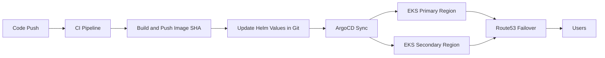

# Multi-Region GitOps DR Platform on AWS

I built this project to practice production-style disaster recovery with Kubernetes, Terraform, and GitOps.
The main idea is simple: run the same app in two AWS regions, keep deployments managed from Git, and fail over traffic automatically when primary goes down.

## What I built

- Terraform setup for two regions (`primary` + `secondary`)
- Reusable Terraform modules for network, EKS, and Route53 failover
- A small app workload deployed through Helm
- ArgoCD app-of-apps structure for GitOps sync
- CI pipeline that builds image, tags with commit SHA, and updates Helm values
- Chaos drill script to simulate primary region outage and test failover runbook

## Architecture flow



## Repo structure

```text
multi-region-gitops-dr/
├── app/                        # demo app (backend + frontend placeholders)
├── terraform/
│   ├── modules/
│   │   ├── network/
│   │   ├── eks/
│   │   └── route53-failover/
│   └── envs/
│       ├── primary/
│       └── secondary/
├── helm/
│   └── dr-demo/
├── argocd/
├── ci/
├── chaos/
├── scripts/
├── docs/
└── README.md
```

## Terraform usage

### 1) Primary region

```bash
cd terraform/envs/primary
terraform init
terraform plan
terraform apply
```

### 2) Secondary region

```bash
cd terraform/envs/secondary
terraform init
terraform plan
terraform apply
```

## GitOps deployment

1. Install ArgoCD in both clusters.
2. Update `argocd/application-primary.yaml` and `argocd/application-secondary.yaml` with your repo URL.
3. Apply both application manifests from each cluster context.

## CI flow

The pipeline in `ci/Jenkinsfile` does the following:

- Run backend tests
- Build and push Docker image with short SHA tag
- Update Helm values image tag
- Commit and push updated tag for ArgoCD sync

## DR drill

Use:

```bash
./chaos/failover-drill.sh
```

This script outlines a safe drill sequence:
- scale down primary app
- verify Route53/health checks
- confirm traffic from secondary
- restore primary

Detailed checklist is in `docs/runbook.md`.

## Notes

- This is a practical portfolio baseline, not a full enterprise blueprint.
- For production, add WAF, secrets management, backup automation, and tighter IAM.
